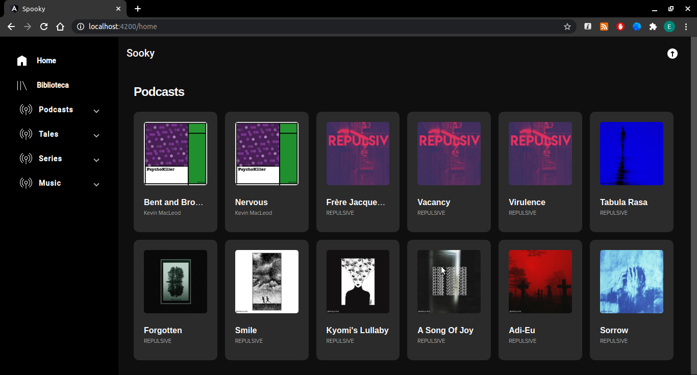
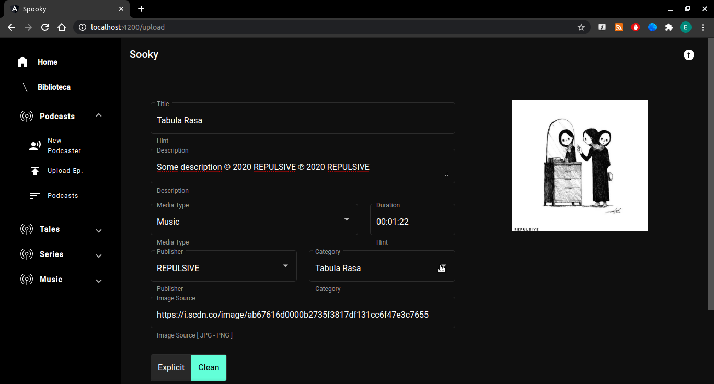

# Spooky App Admin

<strong>Main Page</strong>

Here are some screenshots of the web application used to manage the content of the Spooky mobile version.

<strong>Upluad Content</strong>

Page to upload a new audio file to S3 -Amazon Web Services

